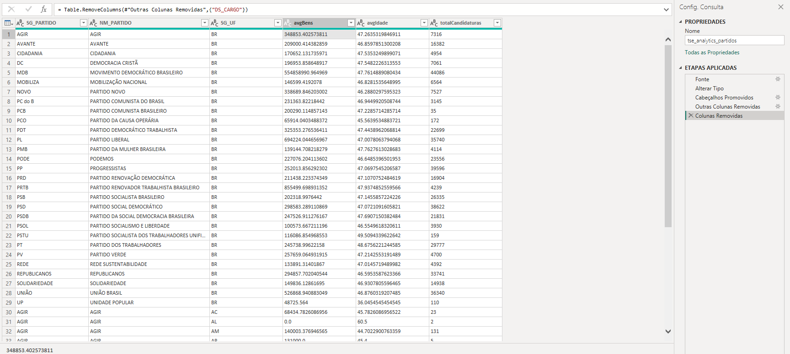
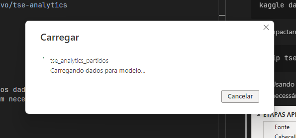
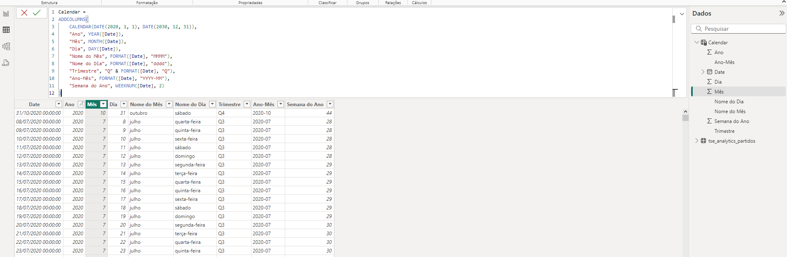

# Trabalho Power BI

## Descrição:

1. Obtenha na Internet fonte de dados com no mínimo 1.000 registros (sugestão de local: Kaggle).

Instalando o `kaggle`:

```shell
pip install -r requirements.txt
```

Baixando dataset (com 2.693 linhas):

```shell
kaggle datasets download -d teocalvo/tse-analytics
```

Descampactando o dataset:

```
unzip tse-analytics.zip
```

2. Usando o Power Query, carregue os dados e realize ao menos 3 transformações, mesmo que não sejam necessárias para os visuais (apenas para exemplificar).



Finalizando:



3. Definir tabela Calendário para uso nos visuais, conforme exemplificado nos tutoriais.




4. Implemente exemplos de todos os recursos visuais demonstrados nos tutoriais disponibilizados no Teams.

```shell
pip install -r requirements.txt
```

```shell
kaggle datasets download -d teocalvo/tse-analytics
```